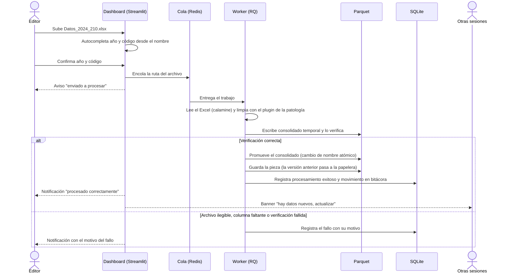

<p align="center">
  
</p>

<p align="center">
  Sistema de Vigilancia Departamental del Magdalena<br>
  CITES - Centro de Innovación y Transferencia en Salud, Universidad del Magdalena
</p>

# SIVIDEM

SIVIDEM es un dashboard web de vigilancia epidemiológica para el departamento del Magdalena (Colombia). Convierte los microdatos que publica el INS en el portal SIVIGILA en indicadores, mapas, canales endémicos y pronósticos de corto plazo, listos para apoyar decisiones de salud pública a nivel departamental, subregional y municipal.

La primera patología implementada es dengue. El sistema está construido como plataforma modular: cada patología es un plugin que cumple un contrato común, de modo que se pueden agregar nuevas (por ejemplo tuberculosis) sin modificar el núcleo.

## Qué ofrece

- Situación actual: incidencia, mortalidad y letalidad del año (con alerta si la letalidad supera la meta nacional del INS), mapa del estado epidemiológico de cada subregión y canal endémico por los métodos de cuartiles y Bortman, lado a lado, como recomienda el INS.
- Pronóstico: casos esperados en las próximas 1 a 4 semanas con un modelo Prophet autorregresivo, banda de incertidumbre y modo de validación con ejemplos históricos reales en el que el modelo solo ve datos hasta una fecha pasada y se compara con lo que ocurrió después.
- Tendencia: casos por año, comparación semanal contra el año anterior, variación porcentual, mapa interactivo de incidencia en tres niveles (subregión, municipio y zona) y evolución por territorio.
- Sociodemográfica: pirámide por sexo y edad, grupos vulnerables, área, estrato, etnia, pueblos indígenas, régimen de salud, EPS y UPGD notificadoras.
- Morbilidad: gravedad, hospitalización, flujo de clasificación inicial a final (diagrama de Sankey), fuente de notificación y tasas por subregión y municipio.
- Mortalidad: muertes, letalidad y letalidad grave por subregión con referencia departamental, distribución por sexo, edad, semana, régimen y EPS, tabla por territorio y causas CIE-10.
- Gestión de datos desde la interfaz: subida de archivos SIVIGILA, reemplazo de archivos corregidos, papelera con restauración, historial de procesamientos y bitácora de auditoría.
- Multiusuario con roles (Visor, Editor, Admin) y autenticación centralizada en Keycloak.

La descripción completa de cada pestaña, con sus gráficas, selectores y reglas de cálculo, está en la [guía de módulos](docs/modulos.md).

<!-- Capturas del sistema: agregar aquí imágenes de docs/img/ (por ejemplo situacion.png, pronostico.png, tendencia-mapa.png, morbilidad-sankey.png, gestion-piezas.png). -->

## Principios del diseño

- Los números falsos no se publican. Si falta un insumo para un indicador (un código sin subir, población DANE de un año, historia insuficiente para una línea base), el indicador se muestra como "No disponible", nunca como cero.
- Tasas donde el denominador es confiable. Las tasas se calculan solo para el Magdalena y, como regla general, por subregión: agregar municipios reduce el efecto de la subnotificación causada por pacientes que se atienden fuera de su municipio de residencia. El denominador es la población en riesgo según una estratificación calculada por el propio sistema con el lineamiento MSPS/INS 2020-2023.
- Metodologías oficiales y explicadas en pantalla. El canal endémico sigue las recomendaciones del INS (línea base de 5 a 7 años, exclusión manual de años atípicos) y cada método tiene su diálogo de metodología con fórmulas y ejemplos. El pronóstico incluye un diálogo con la fundamentación del modelo.
- El dashboard nunca lee datos a medio escribir. El consolidado se reescribe con un archivo temporal, se verifica y solo entonces reemplaza al oficial en un cambio de nombre atómico.
- La persona decide cuándo cambian sus datos. El consolidado se carga una vez por sesión; los filtros operan en memoria. Cuando alguien sube datos nuevos, todas las personas conectadas reciben un aviso para actualizar cuando lo decidan.
- Contrato e implementaciones intercambiables. Las patologías (PathologyPlugin) y el proveedor de identidad (AuthProvider) están detrás de contratos abstractos: cambiar Keycloak por otro proveedor, o agregar una patología, es cambiar o agregar una pieza sin tocar el resto.

## Arquitectura

SIVIDEM se despliega como cuatro contenedores orquestados con Docker Compose: la aplicación web (Streamlit), un worker de procesamiento (RQ), la cola (Redis) y el proveedor de identidad (Keycloak). Los datos de casos se guardan en Parquet y el estado operativo (procesamientos, bitácora, registro de archivos) en SQLite.

### Vista de contenedores


### Vista de despliegue


### Vista de componentes

El núcleo (core/) no conoce ninguna patología en particular; cada patología vive en pathologies/ e implementa el contrato PathologyPlugin.


### Flujo de una carga de datos

La interfaz nunca procesa archivos: los encola y la persona sigue trabajando. El worker atiende un archivo a la vez, así que dos subidas simultáneas se procesan en orden sin conflicto.



## Tecnologías

| Área | Herramienta |
|---|---|
| Interfaz y visualización | Streamlit, Plotly |
| Identidad y acceso | Keycloak (python-keycloak) |
| Procesamiento asíncrono | Redis, RQ |
| Datos de casos | Parquet (pandas, pyarrow) |
| Estado, bitácora y registro | SQLite |
| Lectura de Excel grandes (.xls y .xlsx) | calamine |
| Limpieza de datos | pandas, scikit-learn |
| Pronóstico | Prophet (cmdstanpy), epiweeks |
| Despliegue | Docker, Docker Compose |

## Estructura del repositorio

```
.
├── app.py                      # Entrada del dashboard: registra las patologías y arranca la interfaz
├── worker.py                   # Entrada del worker: atiende la cola, un archivo a la vez
├── docker-compose.yml
├── Dockerfile
├── requirements.txt
├── assets/                     # Logo e íconos institucionales
├── core/                       # Núcleo, independiente de cualquier patología
│   ├── auth/                   # Contrato AuthProvider, implementación Keycloak y permisos por rol
│   ├── audit/                  # SQLite: procesamientos, bitácora y registro de piezas
│   ├── dashboard_base/         # Layout, login, filtros globales, avisos y pestaña de Gestión
│   ├── ingestion/              # Cola, procesador de piezas y papelera
│   ├── storage/                # Piezas, consolidado y escritura atómica de Parquet
│   ├── references/             # GeoJSON de municipios
│   ├── geografia.py
│   └── registry.py             # Contrato PathologyPlugin y registro de patologías
├── pathologies/
│   └── dengue/                 # Plugin de dengue
│       ├── manifest.yaml       # Nombre, códigos esperados, rutas y columnas
│       ├── plugin.py           # Implementación del contrato
│       ├── clean.py            # Limpieza de los archivos SIVIGILA
│       ├── indicators.py       # Incidencia, mortalidad, letalidad
│       ├── canal_endemico.py   # Cuartiles y Bortman
│       ├── estratificacion.py  # Estratificación de riesgo MSPS/INS
│       ├── poblacion.py        # Población DANE y población en riesgo
│       ├── prediccion.py       # Modelo Prophet-AR
│       ├── schema.py           # Esquema estable de los datos procesados
│       ├── config/             # Subregiones y tablas de referencia
│       └── views/              # Las seis pestañas de análisis
├── docs/                       # Guía de módulos y diagramas
└── data/                       # Piezas, consolidado, papelera y sistema.db (generados en ejecución)
```

## Puesta en marcha

### Requisitos

- Docker y Docker Compose.
- Para desarrollo sin Docker: Python 3.12 y un servidor Redis. El worker de RQ requiere un sistema tipo Unix (Linux, macOS o WSL); en Windows, usar Docker para el worker.

### 1. Variables de entorno

```bash
cp .env.example .env
```

Completar .env. Dentro de Docker Compose el dashboard llega a Keycloak por el nombre del servicio:

```env
KEYCLOAK_SERVER_URL=http://keycloak:8080/
KEYCLOAK_REALM=cites
KEYCLOAK_CLIENT_ID=dashboard
KEYCLOAK_CLIENT_SECRET=<secreto del cliente en Keycloak>
```

### 2. Levantar los servicios

```bash
docker compose up --build
```

- Dashboard: http://localhost:8501
- Consola de Keycloak: http://localhost:8080 (credenciales iniciales admin / admin definidas en docker-compose.yml; cambiarlas fuera de un entorno local)

La primera construcción tarda varios minutos porque Prophet compila cmdstan durante la instalación.

### 3. Configurar Keycloak

1. Crear el realm cites.
2. Crear el cliente dashboard con autenticación de cliente activada y el flujo Direct access grants habilitado (el login usa usuario y contraseña). Copiar su secreto en KEYCLOAK_CLIENT_SECRET y reiniciar el dashboard.
3. Crear los realm roles Visor, Editor y Admin.
4. Crear las cuentas y asignar a cada una uno de esos roles. Una cuenta sin ninguno de los tres roles no puede ingresar.

| Rol | Permisos |
|---|---|
| Visor | Ver todas las pestañas de análisis. |
| Editor | Todo lo del Visor, más subir, reemplazar y enviar a papelera archivos, restaurar desde la papelera y consultar procesamientos y bitácora. |
| Admin | Todo lo del Editor, más eliminar archivos para siempre desde la papelera. |

Los permisos de cada rol se definen en la aplicación (core/auth/permisos.py); Keycloak solo entrega la identidad y el rol.

### Desarrollo sin Docker

```bash
python -m venv .venv
source .venv/bin/activate
pip install -r requirements.txt

# con Redis y Keycloak disponibles y .env apuntando a ellos (por ejemplo KEYCLOAK_SERVER_URL=http://localhost:8080/)
python worker.py
streamlit run app.py
```

## Carga de datos

1. Descargar del portal de microdatos de SIVIGILA (INS) los archivos de dengue por año: código 210 (dengue), 220 (dengue grave) y 580 (mortalidad por dengue). El portal los nombra Datos_AÑO_CÓDIGO, por ejemplo Datos_2024_580.xls.
2. Ingresar con una cuenta Editor o Admin, abrir la pestaña Gestión y subir cada archivo. El sistema propone año y código a partir del nombre y pide confirmarlos.
3. La matriz de Piezas activas muestra qué combinaciones de año y código faltan.

Algunos análisis necesitan historia acumulada: el canal endémico pide al menos 5 años anteriores al año de vigilancia, la estratificación de riesgo (y con ella las tasas con población en riesgo) pide 6 años y el pronóstico necesita alrededor de 120 semanas continuas.

El procesamiento recorta automáticamente los casos al Magdalena por departamento de ocurrencia, valida los municipios contra DIVIPOLA y enriquece el dato con las tablas de referencia de pathologies/dengue/config/referencias (DIVIPOLA, países, ocupaciones, aseguradoras, CIE-10, grupos étnicos y proyecciones de población DANE).

## Agregar una nueva patología

1. Crear la carpeta pathologies/nombre_patologia/ con su manifest.yaml (nombre, códigos esperados, rutas y columnas).
2. Implementar una clase que herede de PathologyPlugin (core/registry.py): limpieza, indicadores, canal endémico, esquema, mapeo de subregiones y la lista de pestañas que expone. La estratificación de riesgo es opcional.
3. Registrar el plugin en app.py y en worker.py con registrar_patologia(...).

El selector de patología, los filtros globales, la subida de archivos, la papelera, el historial, los avisos y la escritura atómica funcionan sin cambios para la nueva patología.

## Metodología y referencias

- Protocolo de vigilancia en salud pública de dengue, Instituto Nacional de Salud (INS).
- Bortman M. Elaboración de corredores o canales endémicos mediante planillas de cálculo. Rev Panam Salud Pública. 1999;5(1).
- Lineamiento metodológico para la estratificación y estimación de la población en riesgo para arbovirosis en Colombia 2020-2023, Ministerio de Salud y Protección Social e INS.
- Proyecciones de población municipal DANE, Censo Nacional de Población y Vivienda 2018.
- Taylor SJ, Letham B. Forecasting at scale. The American Statistician. 2018;72(1).

## Créditos

Desarrollado para el CITES (Centro de Innovación y Transferencia en Salud) de la Universidad del Magdalena, Santa Marta, Colombia.
