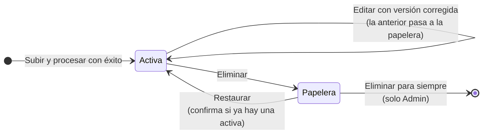

# Guía de módulos de SIVIDEM

Descripción detallada de lo que la persona usuaria ve y puede hacer en cada pestaña del dashboard: componentes en el orden en que aparecen, selectores, parámetros, mensajes informativos y reglas de cálculo. Para la visión general del proyecto, la arquitectura y la instalación, ver el [README principal](../README.md).

Contenido:

- [Contexto común a todos los módulos](#contexto-común-a-todos-los-módulos)
- [Situación](#situación)
- [Pronóstico](#pronóstico)
- [Tendencia](#tendencia)
- [Sociodemográfica](#sociodemográfica)
- [Morbilidad](#morbilidad)
- [Mortalidad](#mortalidad)
- [Gestión](#gestión)

## Contexto común a todos los módulos

### Qué es SIVIDEM

Dashboard web de vigilancia epidemiológica del departamento del Magdalena (Colombia), desarrollado para el CITES (Centro de Innovación y Transferencia en Salud) de la Universidad del Magdalena. La primera patología implementada es dengue. El sistema está diseñado como plataforma modular: cada patología es un complemento (plugin) que cumple un contrato común, de modo que agregar una nueva patología (por ejemplo tuberculosis) no requiere modificar el núcleo.

Fuente de datos: archivos Excel de microdatos del portal SIVIGILA del INS (Instituto Nacional de Salud), uno por año y código de evento. Para dengue los códigos son 210 (dengue), 220 (dengue grave) y 580 (mortalidad por dengue).

Alcance geográfico: exclusivamente el departamento del Magdalena (código DANE 47, 30 municipios), por territorio de ocurrencia del caso. No hay vista nacional ni comparación con otros departamentos (para eso existe el propio SIVIGILA).

Tecnologías: Streamlit y Plotly (interfaz y gráficos), Keycloak (identidad), Redis y RQ (cola de procesamiento), SQLite (estado, bitácora, registro de archivos), Parquet (datos de casos), Prophet (pronóstico), orquestación con docker-compose.

### Pantalla de inicio de sesión

Pantalla dividida en dos paneles:

- Panel izquierdo (institucional, fondo azul): escudo de la Universidad del Magdalena, nombre SIVIDEM y su significado, acento tricolor institucional (azul, naranja, verde), un párrafo que describe la herramienta ("Herramienta de análisis epidemiológico departamental para la toma de decisiones en salud pública...") y una lista de capacidades: análisis de tendencias y ciclos epidémicos; situación epidemiológica actual por subregión; perfil sociodemográfico de la población afectada; indicadores de morbilidad, mortalidad y letalidad; canal endémico y pronóstico de corto plazo. Al pie, el logo de SIVIDEM y la leyenda "CITES - Centro de Innovación y Transferencia en Salud, Universidad del Magdalena, Santa Marta, Colombia".
- Panel derecho (formulario): rótulo "Acceso restringido", título "Bienvenido", campos de correo electrónico institucional y contraseña, botón "Ingresar al sistema" y una nota de acceso seguro vinculado a la cuenta institucional.

Comportamiento: la verificación de credenciales contra Keycloak se hace en dos fases (primero se envía el formulario, luego aparece un indicador "Verificando credenciales..." en el mismo panel) para evitar parpadeos. Mensajes de error posibles: credenciales inválidas o usuario sin rol asignado; servidor de autenticación no disponible.

### Roles y permisos

Keycloak solo entrega la identidad y la etiqueta del rol; qué puede hacer cada rol lo decide la aplicación.

| Rol | Público previsto | Qué puede hacer |
|---|---|---|
| Visor | Estudiantes | Ver las seis pestañas de análisis. No ve la pestaña Gestión. |
| Editor | Personal CITES | Todo lo del Visor, más subir, reemplazar (editar) y enviar a papelera archivos; restaurar desde la papelera; ver Procesamientos y Bitácora. Alcance global: gestiona cualquier patología. |
| Admin | Administración | Todo lo del Editor, más eliminar para siempre desde la papelera. |

### Barra superior y encabezado

Fija en la parte superior al desplazarse. Contiene:

- Título "Vigilancia de Dengue" y un contador: "N registros tras los filtros, de M en el consolidado". Permite ver en todo momento cuánto del universo de datos se está analizando.
- A la izquierda, marca SIVIDEM con el texto "CITES - Universidad del Magdalena".
- Al centro, selector de patología (hoy solo dengue; muestra las patologías habilitadas).
- A la derecha, nombre de la persona usuaria, su rol y botón de cerrar sesión.

### Barra lateral: filtros globales

Todos los filtros operan sobre los datos ya cargados en memoria de la sesión; moverlos nunca relee el archivo del disco, por eso la respuesta es inmediata.

- Botón "Actualizar datos" (principal): recarga el consolidado desde disco. Es uno de los tres únicos momentos en que los datos cambian (los otros dos son refrescar la página e iniciar sesión).
- Encabezado "Filtros" con una insignia que indica cuántos filtros están activos (por ejemplo "3 activos").
- Botón "Limpiar filtros": restablece todos.
- Territorio:
  - Subregión: botones tipo píldora, selección múltiple, con las 5 subregiones oficiales: Santa Marta, Centro, Norte, Río y Sur.
  - Municipio: lista desplegable de selección múltiple, subordinada a la subregión (si se eligió una subregión, solo ofrece sus municipios).
- Periodo:
  - Años: deslizador de rango (por ejemplo 2019 a 2024).
  - Semana epidemiológica: deslizador de rango, rotulado "Sem. 1" a "Sem. 53" (convención CDC, semana que inicia en domingo).
- Estratificación de riesgo: píldoras de selección múltiple con el nivel de transmisión calculado para cada municipio según el lineamiento MSPS/INS 2020-2023 (niveles posibles: Sin riesgo, Sin transmisión sin vector, Sin transmisión con vector, Baja, Mediana, Alta y Muy alta transmisión). Solo aparece si la estratificación se pudo calcular (requiere 6 años de histórico).
- Clasificación del caso: píldoras de selección múltiple sobre la clasificación final del caso (Sospechoso, Probable, Confirmado por laboratorio, Confirmado por clínica, Confirmado por nexo epidemiológico, Descartado, No aplica, Otro, Error de digitación; solo aparecen las presentes en los datos).

No existe filtro de departamento: el Magdalena es el techo fijo del sistema.

Resumen de filtros en cada gráfica: junto al título de cada gráfica aparece entre paréntesis un resumen de los filtros activos, por ejemplo "Casos por año (Centro · 2022-2024)". Así cada gráfica se explica sola en una captura sin necesidad de ver la barra lateral. Las secciones que tienen selector de año propio omiten el año y la semana del resumen para no inducir a error.

### Avisos y notificaciones

- Banner de datos nuevos: cuando alguien procesa un archivo y el consolidado oficial cambia, a todas las personas conectadas (cualquier rol) les aparece, en unos 4 segundos, un banner delgado "Hay datos nuevos disponibles para esta patología" con botón "Actualizar" y una x para cerrarlo. Cerrarlo no pierde información: el procesamiento queda registrado en Procesamientos.
- Notificación del resultado de una subida: solo a quien subió el archivo, como notificación emergente (toast): "Datos_2024_210: procesado correctamente" o "Datos_2024_210: falló. [motivo]".

### Reglas de cálculo transversales

- Casos = códigos 210 + 220. Muertes = código 580.
- Incidencia = casos (210+220) / población en riesgo x 100.000.
- Mortalidad = muertes (580) / población en riesgo x 100.000.
- Letalidad = muertes (580) / casos (210+220) x 100. Meta nacional INS: menor a 0,10 %.
- Letalidad de dengue grave = muertes (580) / casos de dengue grave (220) x 100.
- Población en riesgo: proyecciones DANE (Censo 2018) de los municipios clasificados con transmisión según la estratificación de riesgo MSPS/INS, calculada por el propio sistema con 4 variables (altura, presencia del vector, magnitud de casos y persistencia de la transmisión, puntaje 0 a 12). Cuando el periodo abarca varios años, la población se suma año a año (persona-años).
- Regla de "no disponible": si falta un insumo necesario (por ejemplo población DANE de algún año, o los 6 años de histórico que exige la estratificación), el indicador se muestra como "No disponible", nunca como cero. El sistema no publica números falsos.
- Las tasas se calculan solo para el Magdalena, a nivel de subregión como regla general; el mapa, la hospitalización por territorio y los KPI de incidencia y mortalidad también las muestran a nivel municipio.
- Subregiones: mapeo por código DIVIPOLA en un único archivo de configuración, fácil de modificar.

## Situación

### Propósito

Resumen ejecutivo de "cómo estamos ahora": los tres indicadores clave del año, el estado epidemiológico de cada subregión en su última semana reportada y el canal endémico, que compara la semana actual contra el comportamiento histórico de esa misma semana.

### Datos y filtros

- Usa los casos 210+220 para el mapa y el canal endémico, y además el 580 para los KPI de mortalidad y letalidad.
- Responde a los filtros globales. El filtro de años de la barra lateral limita la historia disponible para la línea base; si se acota demasiado, el sistema avisa que no hay años suficientes.

### Componentes (en orden de aparición)

#### Selector "Año de los indicadores"

Deslizador de un solo año que por defecto se ubica en el año más reciente. Afecta solo a los tres KPI de arriba (no al mapa ni al canal). Texto de ayuda: los indicadores son anuales porque la letalidad se compara con la meta anual del INS. Debajo, la leyenda "Indicadores del año N".

#### KPI principales (3 tarjetas)

- Incidencia: casos (210+220) / población en riesgo x 100.000.
- Mortalidad: muertes (580) / población en riesgo x 100.000.
- Letalidad: muertes / casos x 100, con 4 decimales. Si supera la meta INS de 0,10 %, la tarjeta muestra la etiqueta "Supera la meta INS" en color de alerta; el texto de ayuda indica si el año cumple o supera la meta.
- Si incidencia o mortalidad no se pueden calcular, muestran "No disponible" con un texto de ayuda que explica el motivo (falta población DANE o faltan los 6 años de histórico que pide el lineamiento).

#### Situación actual por subregión (mapa)

- Mapa coroplético del Magdalena con las 5 subregiones como polígonos (al pasar el cursor se resalta la subregión completa). Cada subregión se colorea según la zona del canal endémico en que está su última semana reportada: Éxito, Seguridad, Alerta, Epidemia o "Sin datos suficientes" (gris). Los colores son los institucionales reservados para estados epidemiológicos.
- A la derecha del mapa, una tarjeta por subregión con su nombre, su zona y la semana y año de referencia ("Seguridad - semana 20 de 2024").
- Encima del mapa, una leyenda con la semana de referencia: si todas las subregiones comparten la misma semana se indica una sola; si alguna reporta con más rezago, se avisa que el detalle está en cada tarjeta.
- Panel desplegable "Ajustar año de vigilancia y línea base histórica" con los mismos controles del canal endémico (ver abajo), aplicados a las 5 subregiones a la vez.
- Panel desplegable "¿Cómo se lee este mapa?": explica que cada subregión se compara contra su propia última semana con casos (no una semana fija del calendario), que no se inventan semanas futuras, que la comparación es siempre contra la misma semana calendario de los años base (no contra el promedio anual), y remite al botón Metodología.
- La situación del mapa se calcula con el método de cuartiles.

#### Canal endémico

- Título con botón "Metodología" a la derecha.
- Controles superiores:
  - Escala: control segmentado "Subregión" / "Municipio" (el canal se ofrece en ambas escalas).
  - Territorio: lista desplegable con las subregiones o los municipios, según la escala.
- Dos gráficas lado a lado, una por método, como recomienda el INS para confirmar señales de alerta:
  - Cuartiles / medianas (INS Colombia): líneas Cuartil inferior (P25), Mediana (P50), Cuartil superior (P75).
  - Bortman (media geométrica): líneas Límite inferior IC 95 %, Umbral estacional, Límite superior IC 95 %.
  - En ambas: el área bajo la curva se divide en zonas sombreadas (Éxito, Seguridad, Alerta; lo que queda por encima del límite superior es Epidemia). Los casos semanales del año de vigilancia se dibujan como puntos, cada uno coloreado según la zona en que cae. Eje X: semana epidemiológica; eje Y: casos. Si no hay datos del año de vigilancia, aparece la anotación "Sin datos notificados para N".
- Parámetros del canal (debajo de las gráficas, para no desplazarlas):
  - Año de vigilancia: lista desplegable.
  - Años hacia atrás en la línea base: deslizador de 5 a 7 años (recomendación INS: menos de 5 no es confiable; más de 7 diluye el comportamiento reciente). Si solo hay 5 años disponibles se usan todos y se informa.
  - Excluir años de la línea base: selección múltiple para retirar años atípicos (por ejemplo un año de brote que inflaría el canal). Al excluir un año, la ventana se extiende automáticamente con el siguiente año más antiguo disponible para mantener el tamaño elegido. La exclusión es manual a propósito: un brote real y un año con datos incompletos se ven parecidos en las cifras y solo una persona con contexto puede distinguirlos.
  - Leyenda final: "Línea base: N años (lista de años)".
  - Si no hay al menos 5 años anteriores al año de vigilancia (o quedan menos de 5 tras las exclusiones), se muestra una advertencia que explica la recomendación del INS y cómo resolverlo.

#### Diálogo "Metodología del canal endémico"

Ventana emergente amplia con:

- Descripción general y 4 tarjetas de colores con la definición de cada zona (Éxito, Seguridad, Alerta, Epidemia).
- Pestaña "Cuartiles / medianas": fórmulas de P25, P50 y P75, ejemplo numérico (semana 14 con 5 años de línea base) y tabla de clasificación de casos en zonas.
- Pestaña "Bortman": fórmulas con corrección de Kirkwood (ln(v+1)), media y desviación en escala logarítmica, margen del IC 95 % con t de Student, ejemplo numérico paso a paso con los mismos datos, y tabla de clasificación.
- Pestaña "Comparativa": tabla que contrasta ambos métodos (tipo, sensibilidad a extremos, manejo de semanas en cero, base de los límites, años mínimos).
- Pestaña "Recursos": enlaces al protocolo de vigilancia de dengue del INS, manual SIVIGILA, portal de microdatos, documento del INS sobre comportamientos inusuales y el artículo original de Bortman (1999).

## Pronóstico

### Propósito

Estimar cuántos casos de dengue se esperan en las próximas 1 a 4 semanas en el Magdalena, como apoyo a la alerta temprana. Es "qué se espera" a continuación de "cómo estamos ahora".

### Datos y filtros

- Serie semanal departamental única (todo el Magdalena) de casos 210+220, construida con todas las semanas del rango (las semanas sin casos se registran como cero, porque son un dato real).
- No depende de ningún filtro global. El modelo se validó a escala departamental, sin desagregación territorial. Si la persona tiene activo un filtro de subregión o municipio, aparece el aviso "Tienes un filtro de subregión o municipio activo: no afecta a esta pestaña, el pronóstico siempre es departamental".

### Modelo

- Prophet con componente autorregresivo (Prophet-AR), sin variables climáticas: estacionalidad anual más regresores con los casos (en escala log1p) de 1, 2, 4 y 8 semanas atrás.
- Elegido entre 6 familias evaluadas (SARIMAX, Prophet, XGBoost, LightGBM, LSTM, N-BEATS) en un documento técnico de modelado aparte, por ser el de menor dependencia del clima y el de mejor desempeño sin clima desde 2 semanas de horizonte.
- Pronóstico recursivo: para semanas más allá de la primera, los rezagos que caen dentro del horizonte se completan con la propia predicción del modelo.
- Horizonte máximo: 4 semanas.
- Se entrena en vivo dentro del dashboard con todo el histórico cargado y se reentrena automáticamente cuando cambia ese histórico (por ejemplo al subir un año nuevo). No hay un modelo congelado que mantener a mano. El entrenamiento tarda menos de un segundo y queda en caché.
- Requisito mínimo: 120 semanas de histórico (aproximadamente 2,3 años) para estimar la estacionalidad anual. Si no se cumple, se muestra una advertencia con las semanas disponibles.

### Componentes (en orden de aparición)

#### Encabezado

Título "Pronóstico de casos de dengue" con el botón "Fundamentación" a la derecha, y la leyenda "Pronóstico a nivel departamental (todo el Magdalena). No depende de los filtros de la barra lateral...".

#### Selector "Modo"

Lista desplegable con cuatro opciones:

- Pronóstico en vivo (hoy): el pronóstico real de las próximas 4 semanas a partir de la última semana con datos.
- Ejemplo histórico: inicio del brote de octubre 2018 (subida real hacia el pico de 177 casos por semana de diciembre de 2018).
- Ejemplo histórico: descenso tras el pico de enero 2019 (bajada real tras ese mismo pico).
- Elegir otra semana...: habilita un selector de fecha para usar cualquier semana del histórico como punto de partida; la fecha se ajusta al inicio de la semana epidemiológica correspondiente.

En los modos históricos el mismo modelo de producción se entrena solo con datos hasta esa fecha (nunca ve lo que pasó después) y la gráfica superpone lo que realmente ocurrió. Aparece un aviso destacado: "Estás viendo un EJEMPLO HISTÓRICO, no el pronóstico de hoy...". Los dos ejemplos fijos van en direcciones opuestas a propósito, y la opción de elegir cualquier semana permite que cualquier persona verifique el modelo con la fecha que quiera: es una validación honesta, no un caso seleccionado a conveniencia.

#### Leyenda de entrenamiento

"Modelo entrenado con N semanas de histórico (año inicial - año final)".

#### Selector "Métrica"

Control segmentado: "Casos" o "Tasa semanal (x100.000 hab.)" (por defecto, tasa). La tasa usa la población total del Magdalena (30 municipios), no la población en riesgo, porque el pronóstico es una serie departamental no filtrable. Es una tasa semanal y por eso no es comparable con la incidencia anual de Situación.

#### Gráfica de pronóstico

- Línea azul: histórico.
- Línea naranja punteada con marcadores: pronóstico, conectada visualmente con la última semana real.
- Banda naranja translúcida: banda de incertidumbre (intervalo del 80 % de cada semana).
- Línea vertical punteada: última semana con datos reales.
- En modo histórico, línea gris sólida: lo que realmente pasó en las 8 semanas siguientes (más allá de las 4 del horizonte, para ver la tendencia real).
- Vista inicial ampliada en los últimos 3 meses; el histórico completo está disponible alejando el zoom.

#### Tarjetas por semana

Una tarjeta por cada semana pronosticada ("Semana 23 · 2026: 45 casos"), bajo el rótulo "Próximas semanas" (o "Semanas siguientes al ejemplo histórico"). El texto de ayuda de cada tarjeta muestra la banda de incertidumbre en casos, la tasa semanal y el horizonte (a cuántas semanas de la última semana real está).

#### Diálogo "Fundamentación del pronóstico"

Resumen del documento técnico en cuatro pestañas:

- Resumen: las 6 familias evaluadas con evaluación walk-forward multi-paso (origen móvil) y las tres razones de la elección de Prophet sin clima (pérdida de R2 entre 0,006 y 0,026 al quitar el clima, la menor de todas; mejor desempeño sin clima desde 2 semanas; a 4 semanas R2 0,73 sin clima frente a 0,77 de los mejores modelos con clima).
- ¿Por qué sin clima?: tabla de pérdida de R2 al quitar humedad, precipitación y temperatura, por modelo y horizonte (Prophet, ARIMA/SARIMA, XGBoost, LightGBM, LSTM, N-BEATS); justificación operativa (costo de mantener series climáticas actualizadas).
- ¿Por qué 4 semanas?: tabla de R2 y RMSE por horizonte (1 semana: R2 0,87, RMSE 12,3; 4 semanas: R2 0,73, RMSE 17,5; 6 semanas: R2 0,62, RMSE 20,8) y comparación contra la línea base de persistencia.
- Datos y validación: serie de referencia de 940 semanas (2007-2024), partición cronológica 70/15/15; aclaración de que el modelo del dashboard se reentrena con el histórico cargado en cada momento y que las métricas citadas son las de la validación del documento técnico, no un recálculo en vivo.

## Tendencia

### Propósito

Describir la evolución de los casos en el tiempo y en el territorio: cuántos casos por año, cómo se comporta el año semana a semana frente al anterior, dónde se concentra la incidencia y cómo evoluciona cada subregión o municipio.

### Datos y filtros

- Casos 210+220 (la mortalidad vive en su propia pestaña).
- Responde a todos los filtros globales, salvo la sección de análisis semanal, que tiene selector de año propio e ignora el filtro temporal global (sí respeta los filtros territoriales y de clasificación).

### Componentes (en orden de aparición)

#### KPI (4 tarjetas)

Leyenda previa: los casos totales cubren todo el periodo filtrado; semana pico y municipio más afectado corresponden al año más reciente.

- Casos totales: casos 210+220 en todos los años filtrados.
- Casos del año más reciente (por ejemplo "Casos 2024"), con la variación porcentual frente al año anterior como indicador de cambio con flecha ("+12,3 % vs 2023").
- Semana pico del año más reciente (ayuda: número de casos de esa semana).
- Municipio más afectado del año más reciente (ayuda: número de casos).

#### Casos por año

Gráfica de barras por año con el número de casos sobre cada barra y una línea punteada naranja con el promedio anual, que sirve como referencia de "año alto" o "año bajo".

#### Mapa del Magdalena (tres niveles de detalle, todos en incidencia)

- Nivel 1, subregiones: mapa coroplético de las 5 subregiones coloreadas en escala azul según la incidencia (x100.000 hab.). Al pasar el cursor: subregión, casos e incidencia. Indicación "Haz clic en una subregión para ver el detalle por municipio".
- Nivel 2, municipios: al hacer clic en una subregión, el mapa muestra sus municipios coloreados por incidencia (población en riesgo del municipio), con botón "Volver". Indicación "Haz clic en un municipio para ver sus zonas".
- Nivel 3, zonas: al hacer clic en un municipio, a la izquierda aparece su polígono con la incidencia y a la derecha una gráfica de barras horizontales con la incidencia por zona de ocurrencia: cabecera municipal, centro poblado y rural disperso (el DANE publica población de cabecera por un lado y de centro poblado más rural disperso por otro; estas dos últimas zonas comparten denominador). Botón "Volver".
- Notas al pie: fórmula de la incidencia y aclaración de que los territorios en gris no tienen población DANE para el periodo filtrado.

#### Análisis semanal (selector de año propio)

- Selector "Año de análisis" con la nota "El año de análisis es un selector propio de esta sección e ignora el filtro temporal global".
- Casos semanales del año: barras por semana epidemiológica con línea de promedio semanal.
- Comparación año vs año anterior: barras naranjas del año anterior y línea azul del año seleccionado, semana por semana. Al pasar el cursor: "Semana X · Y casos (año)".
- Variación porcentual semanal frente al año anterior: barras azules para aumentos y naranjas para disminuciones, con línea de referencia en cero.

#### Evolución temporal

- Control segmentado "Agrupar por": Subregión o Municipio.
- Gráfica de líneas con marcadores: incidencia por año (x100.000 hab.), una línea por territorio, con paleta de alto contraste para distinguir hasta 30 municipios.
- Nota: incidencia = casos / población en riesgo x 100.000.

## Sociodemográfica

### Propósito

Caracterizar a la población afectada: quiénes enferman (sexo, edad, grupos vulnerables), dónde viven (área, estrato), su pertenencia étnica, su aseguramiento y qué instituciones notifican.

### Datos y filtros

- Casos 210+220. Son distribuciones en conteos y porcentajes, no tasas.
- Responde a todos los filtros globales (por ejemplo, el filtro de subregión recorta todas las distribuciones).

### Componentes (en orden de aparición)

#### KPI de vulnerabilidad (4 tarjetas)

- Casos totales.
- Gestantes: número y porcentaje del total.
- Menores de 5 años: número y porcentaje del total.
- Mayores de 65 años: número y porcentaje del total.

Los porcentajes usan una precisión adaptativa para que nunca aparezca "0 %" cuando hay casos reales.

#### Pirámide por sexo y edad

Pirámide poblacional de barras horizontales: masculino a la izquierda (azul) y femenino a la derecha (naranja), en grupos quinquenales de 0-4 hasta 65 y más. La edad se construye en el procesamiento a partir de la unidad de medida reportada (años, meses, días, horas, minutos), descartando valores imposibles.

#### Distribución demográfica (explorador interactivo)

Panel a la derecha de la pirámide con un control segmentado "Ver distribución por" y cuatro opciones:

- Área: gráfica de anillo con cabecera municipal, centro poblado y rural disperso (casos y porcentaje).
- Estrato: barras horizontales por estrato socioeconómico.
- Etnia: barras horizontales por pertenencia étnica (Indígena, ROM, Raizal, Palenquero, Afrocolombiano, Ninguno o sin dato).
- Régimen: barras horizontales por régimen de afiliación al SGSSS (Subsidiado, Contributivo, No asegurado, Excepción, Especial, Indígena).

Todas las barras muestran casos y porcentaje.

#### Pueblos indígenas afectados (condicional)

Solo aparece si en los datos filtrados hay casos con pertenencia étnica indígena. Barras horizontales con los 10 pueblos indígenas con más casos (excluye registros sin información).

#### EPS de afiliación y UPGD notificadora

Dos gráficas lado a lado:

- EPS de afiliación: 10 aseguradoras con más casos notificados.
- UPGD notificadora: 10 unidades primarias generadoras de datos con más casos reportados.

Los nombres largos se recortan en el eje y se muestran completos al pasar el cursor.

## Morbilidad

### Propósito

Analizar el comportamiento clínico y de notificación de los casos: gravedad, hospitalización, cómo se clasificaron al inicio y cómo terminaron, por qué fuente se captaron y dónde la incidencia y la hospitalización son más altas.

### Datos y filtros

- Casos 210+220.
- Responde a los filtros globales; las gráficas semanales tienen selector de año propio que ignora el filtro temporal global.
- A diferencia de Situación (un solo año), aquí la incidencia sigue el filtro global de años y permite ver tasas de un rango de años.

### Componentes (en orden de aparición)

#### KPI (5 tarjetas)

Leyenda previa: "Indicadores del período filtrado (año inicial-año final). La incidencia es una tasa anual por 100.000 habitantes."

- Casos totales.
- Incidencia (o "No disponible", con explicación).
- Hospitalizados: número y porcentaje del total.
- Dengue grave (220): número y porcentaje del total.
- Hospitalizados graves: número y porcentaje sobre los casos graves.

#### Tipo de caso

Gráfica de anillo: dengue (210) frente a dengue grave (220), con casos y porcentaje.

#### Gráfico de Sankey (flujo de clasificación)

Diagrama de flujo en tres columnas: Total, Clasificación inicial y Clasificación final. Muestra cómo se distribuyen los casos según su clasificación inicial (Sospechoso, Probable, Confirmado por laboratorio, por clínica o por nexo epidemiológico) y, de ellos, cuáles cambiaron de clasificación al cierre (por ejemplo de Probable a Confirmado por laboratorio o a Descartado). Solo se dibujan los cambios de clasificación; un caso que empieza y termina igual no genera flujo. Cada estado conserva el mismo color en ambas columnas y los flujos toman el color de la clasificación inicial. Tiene encabezados por columna, leyenda de colores y, al pasar el cursor, "origen -> destino: N casos". Los nodos se ordenan para minimizar cruces.

#### Incidencia por subregión

Barras horizontales con la incidencia (x100.000 hab.) de cada subregión, ordenadas de menor a mayor.

#### Fuente de notificación

Barras horizontales por fuente: Rutinaria, Búsqueda activa institucional, Vigilancia intensificada, Búsqueda activa comunitaria e Investigación, con casos y porcentaje. Se usan barras y no anillo porque la diferencia entre la notificación rutinaria y las demás es muy grande.

#### Casos semanales por tipo (selector de año propio)

Barras agrupadas por semana (dengue en azul, dengue grave en naranja) y una línea punteada gris sobre un segundo eje con el porcentaje de casos graves de cada semana.

#### Clasificación final por semana (selector de año propio)

Barras apiladas por semana epidemiológica según la clasificación final del caso.

#### Clasificación final

Gráfica de anillo con la distribución de la clasificación final (Confirmado por laboratorio, por nexo, Probable, Descartado, etc.).

#### Hospitalización por territorio

- Control segmentado "Tipo de caso": Ambos, Dengue (210) o Dengue grave (220).
- Barras horizontales con la tasa de hospitalizados por subregión (x100.000 hab.).
- Barras horizontales con los 15 municipios de mayor tasa de hospitalización.
- Nota: tasa = hospitalizados / población en riesgo x 100.000 en ambos niveles.

#### Hospitalización por semana (selector de año propio)

Barras agrupadas por semana con cuatro categorías: Dengue hospitalizado, Dengue no hospitalizado, Grave hospitalizado y Grave no hospitalizado (tonos sólidos y suaves de azul y naranja).

## Mortalidad

### Propósito

Analizar las muertes por dengue: cuántas, cuándo, quiénes, dónde y si la letalidad supera la meta nacional. El diseño es sobrio: no alarma visualmente, pero tampoco suaviza la realidad. Es el único lugar del dashboard (junto al KPI de letalidad de Situación) donde se usa color de alerta en un indicador, porque existe un umbral epidemiológico definido.

### Datos y filtros

- Muertes (580), cruzadas con casos 210+220 y graves 220 para las letalidades.
- Responde a los filtros globales; la gráfica de muertes por semana tiene selector de año propio.
- Si no hay muertes para los filtros actuales, la pestaña muestra solo el mensaje "No hay muertes por dengue registradas para los filtros actuales".

### Componentes (en orden de aparición)

#### KPI (5 tarjetas)

Leyenda previa: "Indicadores del período filtrado (años). La letalidad se compara con la meta anual del INS."

- Muertes por dengue.
- Mortalidad: muertes / población en riesgo x 100.000 (o "No disponible").
- Menores de 15 años: número y porcentaje del total de muertes (grupo de atención prioritaria).
- Letalidad: con 4 decimales; si supera la meta INS de 0,10 % aparece "Supera la meta INS" en color de alerta. El texto de ayuda explica la meta ("cada 1.000 casos de dengue debería haber menos de 1 muerte") e indica si el periodo la cumple o la supera.
- Letalidad grave: muertes / casos graves x 100.

#### Indicadores por subregión

- Control segmentado "Indicador" con cuatro opciones: Muertes (conteo), Letalidad (%), Letalidad grave (%) y Tasa de mortalidad (x100.000). Por defecto, Letalidad.
- Barras horizontales por subregión con una línea vertical punteada naranja que marca el valor departamental de referencia ("Dpto: valor").
- Si la letalidad departamental supera la meta, aparece la advertencia "La letalidad departamental acumulada de [periodo] supera la meta nacional INS de 0,10 %".

#### Muertes por sexo y edad

Barras horizontales agrupadas por grupo quinquenal de edad, masculino y femenino, con número y porcentaje sobre el total.

#### Muertes por semana epidemiológica (selector de año propio)

Barras por semana con el número de muertes sobre cada barra.

#### Régimen SGSSS

Barras horizontales de muertes por régimen de afiliación, con número y porcentaje.

#### Indicadores por territorio (tabla con niveles)

- Control segmentado "Nivel de agregación": Magdalena, Subregión o Municipio.
- Tabla con columnas Territorio, Muertes, Casos (210+220), Casos graves (220), Letalidad (%) y Letalidad grave (%), ordenada por muertes y con una fila TOTAL al final.
- Es la única vista que baja a nivel municipio en mortalidad, y por eso se queda en conteos y letalidad (que no dependen de población), no en tasas.

#### EPS de afiliación

Barras horizontales con las 10 EPS con más muertes.

#### Causas de muerte asociadas (CIE-10)

Barras horizontales con las 10 causas básicas de muerte más frecuentes según CIE-10, con número y porcentaje; cada causa con su color y su nombre en la leyenda. Los códigos CIE-10 se corrigen y enriquecen con la tabla de referencia durante el procesamiento.

## Gestión

### Propósito

Administrar los datos del sistema desde la propia interfaz, sin tocar archivos ni servidores: subir archivos SIVIGILA, reemplazarlos si traen errores, enviarlos a la papelera, restaurarlos y consultar el historial de todo lo ocurrido. Es la pestaña que convierte al dashboard en un sistema mantenible por el propio equipo del CITES.

### Visibilidad

- Solo aparece para Editor y Admin. El Visor no la ve.
- Encabezado: nota "Piezas, papelera e historial no se actualizan automáticamente" y botón "Actualizar".
- Cuatro subpestañas: Subir, Piezas activas, Papelera e Historial.

### Concepto de pieza

La unidad mínima de datos es la pieza: patología + año + código (por ejemplo dengue 2024 código 210). Es lo que se sube, se reemplaza o se elimina. Los archivos del portal SIVIGILA se llaman Datos_AÑO_CÓDIGO (por ejemplo Datos_2024_580.xls). Se aceptan .xls (formato antiguo, años 2007-2009) y .xlsx.

### Subpestaña Subir

- Zona de carga de archivo (.xls o .xlsx).
- Al cargar, el sistema lee el nombre y autocompleta año y código. Si el nombre no sigue el patrón, avisa y pide completarlos a mano.
- Formulario de confirmación con año y código editables y botón "Confirmar y procesar". La confirmación es una red de seguridad contra archivos mal nombrados.
- Si ya existe una pieza activa con ese año y código, se abre un diálogo "Ya existe una pieza para ese año y código" que advierte que la nueva reemplazará a la anterior (indicando el archivo actual), con opciones Cancelar o "Sí, reemplazar".
- Tras confirmar, aparece un aviso persistente "[archivo] se envió a procesar correctamente" (se cierra con x), la zona de carga se limpia y el archivo entra a la cola. La persona puede seguir trabajando: el procesamiento no bloquea la interfaz.

### Procesamiento en segundo plano (lo que ocurre tras subir)

Un proceso trabajador independiente atiende la cola de a un archivo a la vez (si dos personas suben al mismo tiempo, los archivos se procesan en orden). Por cada archivo:

1. Lee el Excel con un lector rápido (calamine), preparado para archivos de más de 500.000 filas.
2. Lo limpia con el proceso específico de dengue: descarte de unas 29 columnas sin valor analítico, estandarización de nombres y textos, conversión de tipos, construcción de la edad en años, validación geográfica contra DIVIPOLA, recorte a casos ocurridos en el Magdalena, enriquecimiento con tablas de referencia (DIVIPOLA, países, ocupaciones, aseguradoras, CIE-10, grupos étnicos). Resultado: unas 56 columnas.
3. Actualiza el consolidado (la tabla que lee el dashboard) con una operación quirúrgica: agrega las filas de la pieza o, si es un reemplazo, quita las filas de ese año y código y agrega las nuevas. Nunca reprocesa el histórico.
4. Guarda la pieza como archivo Parquet individual; si es un reemplazo, la versión anterior pasa a la papelera.
5. Registra el resultado (listo o fallo, con motivo) y deja traza en la bitácora.

Escritura atómica: el consolidado nuevo se escribe con un nombre temporal, se verifica (que abra, que tenga las columnas y el número de filas esperados) y solo entonces reemplaza al oficial en un cambio instantáneo de nombre. El dashboard nunca puede leer un consolidado a medio escribir. La consolidación se hace antes de guardar la pieza a propósito: si la verificación falla, todavía no se ha tocado ningún archivo de piezas ni de la papelera.

Ante un fallo (archivo ilegible, falta una columna, el consolidado nuevo no pasa la verificación, etc.) no se guarda el Excel, no se tocan los datos previos y el motivo queda registrado como error en el historial de Procesamientos. Al terminar, quien subió recibe la notificación emergente de éxito o fallo, y todas las personas conectadas ven el banner de datos nuevos.

### Ciclo de vida de una pieza

Solo las piezas activas forman parte del consolidado que lee el dashboard. La papelera guarda una versión por año y código: si una pieza se edita dos veces sin restaurar la versión intermedia, la más antigua se reemplaza. Todas las transiciones quedan en la bitácora con usuario y fecha.

### Subpestaña Piezas activas

- Matriz "Años con pendientes": filas = códigos esperados (210, 220, 580), columnas = años que tienen algún código faltante. Cada celda es un botón: azul con marca de verificación si la pieza está cargada, gris con símbolo de error si falta. Al pie de cada columna, "2/3" (códigos completos del año). Si todos los años están completos, se muestra "Todos los años tienen los códigos completos".
  - Al pasar el cursor sobre una celda azul: nombre del archivo y fecha de carga. Al hacer clic: detalle y botones Editar (subir versión corregida) y Eliminar (enviar a papelera).
  - Al hacer clic en una celda gris: carga directa del archivo faltante para ese año y código.
  - Esta matriz responde en segundos a la pregunta "¿qué me falta subir?", que es la que determina si un indicador aparece como "No disponible".
- Panel desplegable "Ver todas las piezas (búsqueda y detalle)": lista de tarjetas con buscador (por archivo, año o código) y paginación de 10 en 10. Cada tarjeta muestra archivo, año, código y fecha, con botones Editar y Eliminar.
- Editar = reemplazar la pieza por una versión corregida (no se editan celdas). Se reprocesa solo esa pieza; la versión anterior pasa a la papelera y es recuperable.
- Eliminar = eliminación lógica: la pieza sale del consolidado y pasa a la papelera.

### Subpestaña Papelera

- Tarjetas con buscador y paginación. Cada tarjeta: archivo, año, código y fecha de eliminación.
- Restaurar (Editor y Admin): pide confirmación. Si ya existe una pieza activa con el mismo año y código, avisa "Ya existe una pieza activa con el mismo año y código. Restaurar la reemplazará" y pide confirmar o cancelar; nunca sobrescribe a ciegas.
- Eliminar para siempre (solo Admin): advertencia de acción irreversible y confirmación explícita "Sí, eliminar para siempre". La traza en la bitácora se conserva aunque el archivo desaparezca.
- La papelera es permanente: nada se borra solo por tiempo.

### Subpestaña Historial

- Procesamientos: tres métricas (Exitosos, Con error, Total), buscador por archivo, año, código o usuario, y tarjetas paginadas con archivo, año, código, fecha, usuario y una insignia "Procesado" (azul) o "Error" (roja). Los fallidos tienen un panel desplegable "Ver motivo del error". Es el registro permanente: sirve para consultar un fallo cuya notificación se cerró sin leer, o para que un colega revise desde otro equipo un error que quien subió no entiende.
- Bitácora de movimientos: filtros por tipo de acción (píldoras: Agregar, Editar, Eliminar, Restaurar, Eliminar para siempre) y por usuario (lista desplegable), contador "N de M movimientos" y tabla con Fecha, Acción, Año, Código y Usuario. Responde a "quién hizo qué, sobre qué pieza y cuándo".
